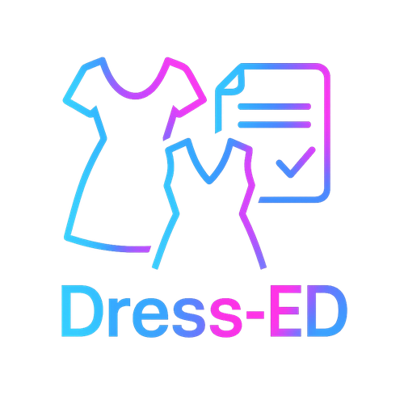
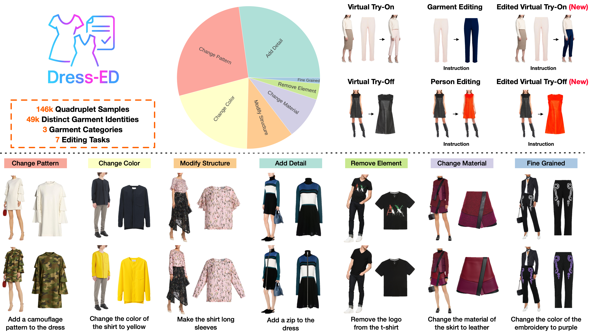
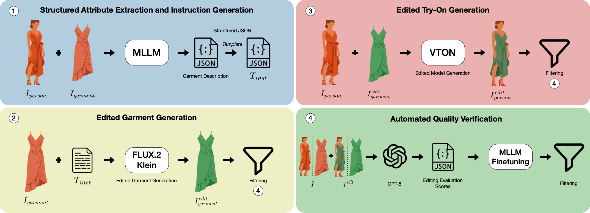

<div align="center">

<h1> Dress-ED: Instruction-Guided Editing for Virtual Try-On and Try-Off</h1>

<p>
  <strong>Fulvio Sanguigni</strong><sup>1,3*</sup>&emsp;
  <strong>Davide Lobba</strong><sup>2,3*</sup>&emsp;
  <strong>Bin Ren</strong><sup>2</sup>&emsp;
  <strong>Marcella Cornia</strong><sup>1</sup>&emsp;
  <strong>Nicu Sebe</strong><sup>2</sup>&emsp;
  <strong>Rita Cucchiara</strong><sup>1</sup>
</p>

<p>
  <sup>1</sup>University of Modena and Reggio Emilia &emsp;
  <sup>2</sup>University of Trento &emsp;
  <sup>3</sup>University of Pisa
</p>

<p><sup>*</sup> Equal contribution</p>

<p><strong>ECCV 2026</strong></p>

<p>
  <a href="https://arxiv.org/abs/2603.22607"></a>
  <a href="https://furio1999.github.io/Dress-ED/"></a>
  <a href="https://huggingface.co/datasets/davidelobba/Dress-ED"></a>
  <a href="#license"></a>
</p>



*Dress-ED is the first benchmark for instruction-driven virtual try-on and try-off,
with over 146k verified quadruplet samples across seven editing types — covering
both appearance and structural garment modifications.*

</div>

---

## 📌 Overview

**Dress-ED** (*Dress Editing Dataset*) is the first large-scale benchmark that unifies
**Virtual Try-On (VTON)**, **Virtual Try-Off (VTOFF)**, and **text-guided garment editing**
within a single framework.
Each sample pairs an in-shop garment image and the corresponding person image with their
edited counterparts and a natural-language instruction describing the desired modification.
The dataset spans **three garment categories**, **seven edit types**, and **146,460 verified
quadruplets**, enabling rigorous training and evaluation of controllable, instruction-driven
fashion generation models.

---

## ✨ Highlights

- **First unified benchmark** integrating VTON, VTOFF, and instruction-driven garment editing in a single framework.
- **146,460 verified quadruplet samples** across three garment categories and seven editing types.
- **49,664 distinct garment identities** and **6,073 unique editing instructions**.
- **Fully automated curation pipeline**: MLLM-based attribute extraction → diffusion-based synthesis → LLM-guided quality verification.
- **Quadruplet structure** `(I_garment, I_person, I_garment_edit, I_person_edit, T_inst)` supports VTON, VTOFF, garment editing, and person editing tasks simultaneously.
- **Evaluation protocol** based on real ground-truth images via an inverse-editing strategy, ensuring unbiased metrics.

## ⚙️ Curation Pipeline

Dress-ED is built on top of [Dress Code](https://github.com/aimagelab/dress-code) through
a fully automated four-stage multimodal pipeline:



**Stage 1 — Structured Attribute Extraction & Instruction Generation**
[Qwen3-VL](https://github.com/QwenLM/Qwen2.5-VL) processes each `(I_garment, I_person)` pair
to extract structured garment semantics (color, pattern, material, neckline, sleeve length, etc.)
as a JSON representation.
Natural-language editing instructions are then synthesized via rule-based templates, covering
both appearance and structural edit categories.

**Stage 2 — Edited Garment Generation**
[FLUX.2 Klein](https://blackforestlabs.ai) applies the editing instruction to the in-shop
garment image, producing `I_garment_edit`. This stage yields ~300k candidate edited garments
across all categories.

**Stage 3 — Edited Try-On Generation**
[FitDiT](https://github.com/BoyuanJiang/FitDiT) renders the person wearing the edited garment,
producing `I_person_edit` for each valid `(I_person, I_garment_edit)` pair.

**Stage 4 — Automated Quality Verification**
A two-step filtering pipeline ensures semantic correctness and visual fidelity:
1. **GPT-5** scores each triplet `(I, I_edit, T_inst)` on instruction adherence, content preservation, and realism (score ∈ [0, 100]).
2. A **fine-tuned InternVL-3.5** verifier — distilled from ~5k GPT-5-annotated samples — is applied at scale. Samples scoring below **80** are discarded.

The final Dress-ED retains **146,460 high-quality verified quadruplets**.

---

## 🧪 Benchmark Tasks

Dress-ED defines two core benchmarks, both evaluated using a **real-image inverse-editing protocol**
(the model reconstructs the original unedited image from its edited counterpart using an inverse
instruction, ensuring metrics are computed against real ground-truth images):

**Instruction-Driven Virtual Try-On**
- *Paired setting*: given `(I_person, I_garment, T_inst)`, generate the person with the garment
  modified as instructed.
- *Unpaired setting*: given `(I_person, I'_garment, T_inst)` with a different garment, generate
  the person wearing the edited version of `I'_garment`.

**Instruction-Driven Virtual Try-Off**
Given `(I_person, T_inst)`, generate the edited in-shop garment `I_garment_edit` matching the
described modification.

---

## 🧱 Dataset Structure

Each sample in Dress-ED is a **verified quadruplet** defined as:

```
S = (I_garment,  I_person,  I_garment_edit,  I_person_edit,  T_inst)
```

| Field | Description |
|---|---|
| `I_garment` | Original in-shop garment image |
| `I_person` | Person wearing the original garment |
| `I_garment_edit` | Edited in-shop garment image |
| `I_person_edit` | Person wearing the edited garment (VTON output) |
| `T_inst` | Natural-language editing instruction |

### Edit Types

Edits are grouped into two macro-categories:

**Appearance edits** — modify the visual properties of the garment:
- `Change Color` · `Change Pattern` · `Change Material` · `Fine-Grained`

**Structural edits** — alter the geometry or composition of the garment:
- `Add Detail` · `Remove Element` · `Modify Structure`

---

## 📊 Dataset Statistics

### By Edit Type

| Edit Type | # Samples | Proportion |
|---|---|---|
| Add Detail | 39,776 | 27% |
| Change Pattern | 39,559 | 27% |
| Change Color | 29,983 | 20% |
| Modify Structure | 15,670 | 11% |
| Change Material | 14,091 | 10% |
| Remove Element | 5,305 | 4% |
| Fine-Grained | 2,076 | 1% |
| **Total** | **146,460** | **100%** |

### By Garment Category

| Category | # Samples |
|---|---|
| Dresses | 80,865 |
| Upper-body | 45,567 |
| Lower-body | 20,028 |

### Splits

Following the same train/test protocol as [Dress Code](https://github.com/aimagelab/dress-code),
with no overlap of garment identities across partitions:

| Split | # Samples |
|---|---|
| Train | 132,201 |
| Test | 14,259 |

All images are standardized to **768 × 1024** resolution.

---


### Evaluation Metrics

| Dimension | Metrics |
|---|---|
| Visual Fidelity | FID · KID · SSIM · LPIPS · DISTS |
| Edit Correctness | DINO-I (content-level similarity to ground truth) |

---

## 📦 Dataset Access

The dataset is available on HuggingFace at [davidelobba/Dress-ED](https://huggingface.co/datasets/davidelobba/Dress-ED).

---

## 📚 Citation

If you use Dress-ED in your research, please cite:

```bibtex
@article{sanguigni2026dress,
  title={Dress-ED: Instruction-Guided Editing for Virtual Try-On and Try-Off},
  author={Sanguigni, Fulvio and Lobba, Davide and Ren, Bin and Cornia, Marcella and Sebe, Nicu and Cucchiara, Rita},
  journal={arXiv preprint arXiv:2603.22607},
  year={2026}
}
```

---

## 🙏 Acknowledgements

Dress-ED extends the [Dress Code](https://github.com/aimagelab/dress-code) dataset.
The curation pipeline builds on [Qwen3-VL](https://github.com/QwenLM/Qwen2.5-VL),
[FLUX.2 Klein](https://blackforestlabs.ai), [FitDiT](https://github.com/BoyuanJiang/FitDiT),
GPT-5, and [InternVL-3.5](https://github.com/OpenGVLab/InternVL).
We thank the authors of these works for making their models publicly available.

---

## License

This dataset is released under the [Creative Commons Attribution-NonCommercial 4.0 International (CC BY-NC 4.0)](https://creativecommons.org/licenses/by-nc/4.0/) license.

You are free to share and adapt the material for **non-commercial research purposes only**, provided appropriate credit is given.
Please also refer to the [Dress Code license](https://github.com/aimagelab/dress-code#license) for terms governing the underlying garment and person imagery.